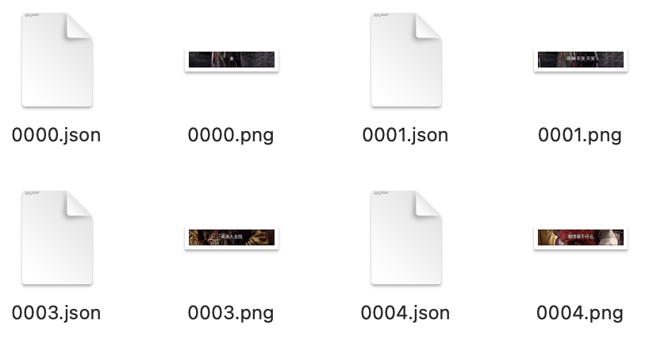

# 视频字幕帧检测

检测视频中字幕的字幕帧，并输出字幕对应的起始、结束时间以及该段时间中的字幕图片。

用轻量级的模型快速提取视频中字幕的时间以及对应字幕图片，方便后续字幕识别的处理。

## 环境配置

下载`practices`并安装：
```bash
git clone https://github.com/taolizhicheng/practices.git
cd practices
pip install .
```

下载本项目：
```bash
git clone https://github.com/taolizhicheng/subtitle-frame-detection.git
cd subtitle-frame-detection
pip install -r requirements.txt
```

## 使用方式

### 环境变量设定与说明

- `DATA_DIR`：数据集目录
- `MODULE_DIR`：本项目所在目录
- `OUTPUT_DIR`：结果输出目录
- `PYTHONPATH`：加入本项目所在目录

数据集目录结构如下：
```text
|-- data/
    |-- video/  # 放置视频文件
        |-- E01.mp4
        |-- ...
    |-- text/   # 放置字幕文本文件
        |-- text1.txt
        |-- ...
    |-- font/   # 放置字体文件
        |-- font1.ttf
        |-- ...
    |-- label/  # 放置字幕标签文件
        |-- E01.json
```

训练数据集会读取video目录下的视频文件，并根据text和font目录下的文件生成字幕图片。

text目录下的文本文件，每一行代表一个字幕，每个文本文件至少100行。

推理数据集会读取video目录下的视频文件，并根据label目录下的文件生成字幕图片。

label目录下的标签文件和video目录下的视频文件一一对应，格式如下：
```json
[
    {
        "time": "00:26:01.200",
        "text": null,
        "rect": null
    },
    {
        "time": "00:26:01.400",
        "text": "你们在干什么",
        "rect": [
            554,
            887,
            812,
            82
        ]
    },
    ...
]
```
每一个元素代表一个字幕帧，`time`为字幕帧的时间，`text`为字幕帧的文本，`rect`为字幕框的坐标，格式为`[x, y, w, h]`。该文件可以用OCR工具生成。

并将数据集目录传入环境变量`DATA_DIR`中。

### 训练

执行训练脚本，根据`configs/train/base.yaml`中的配置进行训练：
```bash
./scripts/train.sh
```

训练模型与结果在`outputs/checkpoints/base`目录下。

### 推理

执行推理脚本，根据`configs/inference/base.yaml`中的配置进行推理（导入的模型文件需要根据情况进行修改）：
```bash
./scripts/inference.sh --video_path /path/to/video --output_dir /path/to/output
```

推理结果如下：


每个图片文件对应一个字幕帧，每个json文件记录该字幕出现的起始、结束时间以及在视频的索引。